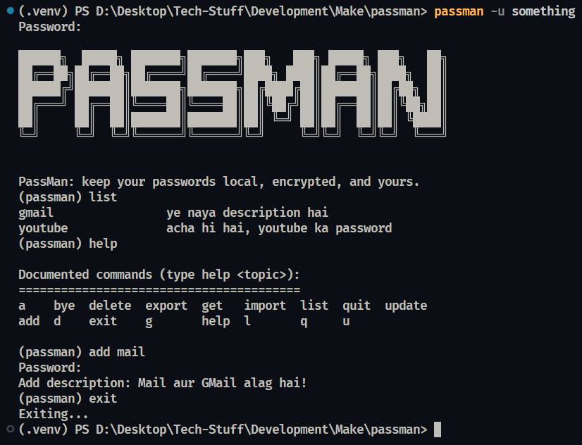

# PassMan


**passman** is a local-first CLI password manager that keeps your passwords encrypted and on your machine.

> Argon2 hashing, Fernet encryption, PBKDF2 key derivation — no cloud, no network, no trust required.



---

## Quick Start

```powershell
git clone https://github.com/JourneyCodesAyush/passman.git
cd passman
uv sync
uv pip install -e . --link-mode=copy
passman signup
```

---

## Usage

```bash
# Create a new user
passman signup

# Login as an existing user
passman -u <username>

# List all saved entry names without logging in
passman list

# Show the installed version
passman -v
```

Once logged in, you get an interactive REPL shell:

```txt
Commands:
  (a)dd <name>               — add a password (prompted securely)
  (g)et <name>               — retrieve a password
  (u)pdate <name>            — update a password (prompted securely)
  (d)elete <name>            — delete a password
  (l)ist                     — list all saved entry names
  export [path]              — export vault to a JSON file
  import <path>              — import entries from a JSON file
  (e)xit / (b)ye             — exit the shell
```

Run `help <command>` inside the REPL for details on any command.

---

## Security Design

- **Master password** — hashed with Argon2, never stored in plaintext
- **Vault passwords** — encrypted with Fernet (AES-128-CBC + HMAC-SHA256)
- **Key derivation** — PBKDF2-HMAC-SHA256 with 600,000 iterations, unique salt per user
- **Salt** — generated at signup with `secrets.token_hex(32)`, stored in the database
- **Session key** — derived at login, lives in memory only, never persisted
- **SQL injection** — parameterized queries throughout

---

## Data Storage

PassMan stores all data locally in a SQLite database. No data ever leaves your machine.

| Platform  | Location                                                                 |
| --------- | ------------------------------------------------------------------------ |
| Windows   | `%LOCALAPPDATA%\.passman\vault.db`                                       |
| macOS     | `~/Library/Application Support/.passman/vault.db`                        |
| Linux/BSD | `$XDG_DATA_HOME/.passman/vault.db` or `~/.local/share/.passman/vault.db` |

> **Note:** Python bundles SQLite in its standard library — no separate SQLite installation is needed.

> [!WARNING]
> **There is no password recovery.** Your vault key is derived from your master password and never stored anywhere. If you forget your master password, your encrypted vault is permanently inaccessible. Back up your master password somewhere safe.

> [!NOTE]
> **Upgrading from before v0.4.0?** The `description` field was added to the `passwords` table in v0.4.0. Existing vaults need a one-time manual migration:
>
> ```sql
> ALTER TABLE passwords ADD COLUMN description TEXT;
> ```

---

## Export / Import

Entries can be exported to a plaintext JSON file for backup or migration, and re-imported later:

```json
[
  {
    "name": "gmail",
    "password": "decrypted_plaintext",
    "description": "personal email"
  }
]
```

`description` is optional on import. If an imported name already exists in your vault, you'll be prompted per-conflict to skip or overwrite it.

> [!WARNING]
> Exported files contain **decrypted plaintext passwords**. Store and delete them carefully.

---

## Motivation

I read about Bitwarden, then KeePassX, and thought — how hard could it be to build one myself? Turns out, not that hard if you let the stdlib do the heavy lifting and let `argon2-cffi` and `cryptography` handle the hard parts.

`passman` has two runtime dependencies. Everything else is stdlib.

---

## License

This project is licensed under the [**MIT License**](./LICENSE).
